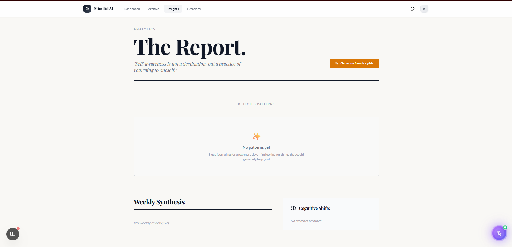
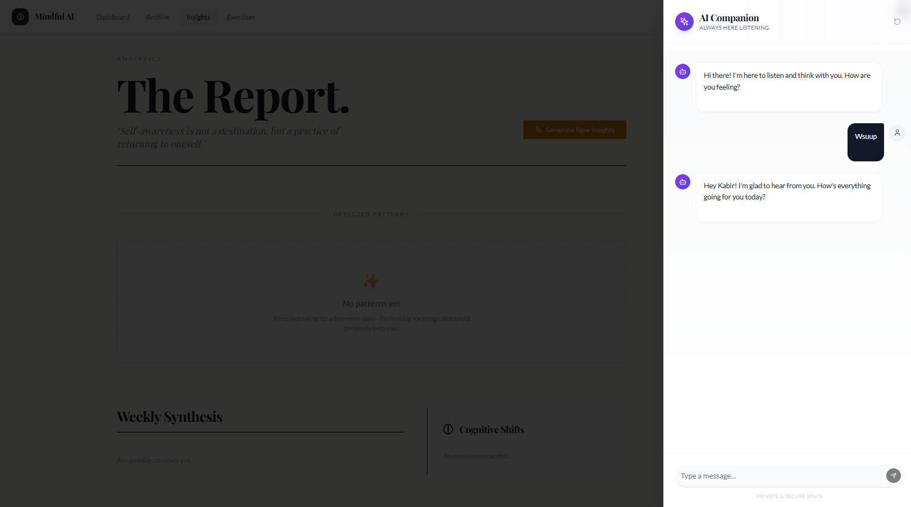

# Mindful AI

A full-stack mental wellness platform built with Next.js 14. Track moods, journal daily, run CBT exercises, and get AI-powered insights from an empathetic companion.

**Repository:** [github.com/Kabir-Narula/Mindful_Ai_DPS](https://github.com/Kabir-Narula/Mindful_Ai_DPS)

## Screenshots

### Daily Dashboard
Morning intentions, pulse checks, journal feed, and proactive AI coaching in one view.


### Insights & Analytics
Pattern detection, weekly synthesis, and cognitive shift tracking.



### AI Companion Chat
Context-aware chat available from any page via the floating companion or nav.



## Features

- **Authentication** — Secure signup/login with JWT HTTP-only cookies
- **Daily Ritual** — Morning intention, pulse checks, quick journal, evening synthesis
- **AI Analysis** — Sentiment analysis and feedback on journal entries (OpenAI)
- **CBT Exercises** — Guided thought-challenging and cognitive reframing
- **Pattern Detection** — AI-detected behavioral patterns from your data
- **Insights Dashboard** — Weekly reviews, mood trends, and cognitive shifts
- **Archive** — Searchable history of past days
- **Streak Tracking** — Build consistent journaling habits
- **Onboarding** — Personalized AI persona based on your preferences

## Tech Stack

| Layer | Technology |
|-------|------------|
| Frontend | Next.js 14, React 18, TypeScript, Tailwind CSS, shadcn/ui |
| Backend | Next.js API Routes, Prisma ORM |
| Database | PostgreSQL |
| AI | OpenAI API |
| Auth | JWT + bcrypt |

## Quick Start

### Prerequisites

- Node.js 18+
- PostgreSQL 14+
- OpenAI API key

### Setup

```bash
# Clone the repo
git clone https://github.com/Kabir-Narula/Mindful_Ai_DPS.git
cd Mindful_Ai_DPS

# Install dependencies
npm install

# Configure environment
cp .env.example .env
# Edit .env with your DATABASE_URL, OPENAI_API_KEY, and JWT_SECRET

# Set up database
npx prisma generate
npx prisma db push

# Start dev server
npm run dev
```

Open [http://localhost:3000](http://localhost:3000).

## Environment Variables

| Variable | Required | Description |
|----------|----------|-------------|
| `DATABASE_URL` | Yes | PostgreSQL connection string |
| `OPENAI_API_KEY` | Yes | OpenAI API key for AI features |
| `JWT_SECRET` | Yes | Secret for signing auth tokens |
| `NEXT_PUBLIC_APP_URL` | No | App URL (default: `http://localhost:3000`) |

## Scripts

```bash
npm run dev          # Development server
npm run build        # Production build
npm run start        # Production server
npm run lint         # ESLint
npm run db:cleanup   # Clean test data from database
```

## Project Structure

```
app/
├── api/              # REST API routes (auth, journal, chat, CBT, patterns)
├── dashboard/        # Main app pages (today, archive, insights)
├── cbt/              # Mental exercises page
├── login/            # Auth pages
├── onboarding/       # User onboarding wizard
components/
├── dashboard/        # Dashboard UI components
├── stream/           # Daily ritual components (pulse, feed, synthesis)
├── cbt/              # CBT exercise components
├── tutorial/         # First-run walkthrough
lib/                  # Services (auth, AI, patterns, streaks, timezone)
prisma/               # Database schema
Shots/                # App screenshots for documentation
```

## CI/CD

GitHub Actions runs on every push and pull request to `main`:

1. Install dependencies
2. Generate Prisma client
3. Lint
4. Production build

See [`.github/workflows/ci.yml`](.github/workflows/ci.yml).

## Deployment

### Vercel (recommended)

1. Push to GitHub
2. Import repo on [Vercel](https://vercel.com)
3. Add environment variables from `.env.example`
4. Deploy
5. Run `npx prisma db push` against your production database

### Database

For Neon or other hosted PostgreSQL, set `DATABASE_URL` in your deployment environment. The schema can also be applied via `neon-migration.sql` if needed.

## Security

- Passwords hashed with bcrypt
- JWT stored in HTTP-only cookies
- All API routes require authentication
- Input validation with Zod on all endpoints
- Day log updates scoped to authenticated user (IDOR protection)

## License

Built as a demonstration wellness platform. Use freely as a foundation for your own projects.
