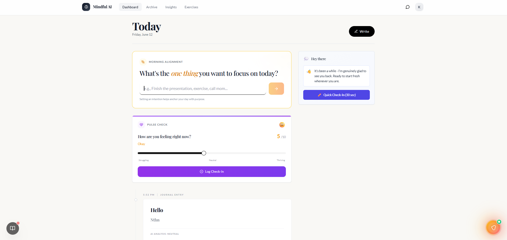

# Mindful AI

A mental wellness platform — journal daily, track moods, run CBT exercises, and get AI-powered insights.

**Live app:** [mindful-ai-dps.vercel.app](https://mindful-ai-dps.vercel.app/)  
**Repo:** [github.com/Kabir-Narula/BetterMind](https://github.com/Kabir-Narula/BetterMind)



## What it does

- Daily ritual — morning intention, pulse checks, journal, evening synthesis
- AI companion — context-aware chat from any dashboard page
- CBT exercises — guided thought challenging and reframing
- Goals, streaks, archive, and weekly insights with pattern detection

## Stack

Next.js 14 · TypeScript · Prisma · PostgreSQL · OpenAI · JWT auth

## Run locally

```bash
git clone https://github.com/Kabir-Narula/BetterMind.git
cd BetterMind
npm install
cp .env.example .env   # set DATABASE_URL, OPENAI_API_KEY, JWT_SECRET
npx prisma generate && npx prisma db push
npm run dev
```

## Deploy

Push to GitHub → import on [Vercel](https://vercel.com) → add env vars from `.env.example` → run `npx prisma db push` on your production DB.

CI runs lint + build on every push to `main`.

## License

Free to use as a foundation for your own projects.
